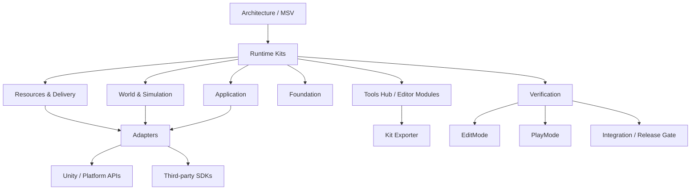

<div align="center">

# ✦ StellarFramework

### Modular · Exportable · Production-Oriented Unity Framework

面向真实 Unity 项目交付的模块化开发框架。<br>
按需选择 Kit，隔离第三方依赖，并配套 Editor Tooling、导出流程与多层自动化验证。


[快速开始](#快速开始) · [核心能力](#核心能力) · [架构](#架构) · [验证体系](#验证体系) · [完整文档](Assets/StellarFramework/FrameworkDoc/README.md) · [English](README_EN.md)

</div>

---

## 为什么是 StellarFramework

StellarFramework 不是把一组 Manager 打包进同一个工程，而是围绕 **可拆分、可替换、可验证** 设计。

| 方向 | 设计目标 |
| --- | --- |
| **Modular Kits** | Kit 尽量保持独立，可按项目需求单独或组合导出 |
| **Adapter Isolation** | Unity API、资源后端、第三方 SDK 和平台能力通过 Adapter 隔离 |
| **Export Profiles** | 导出器自动处理已声明依赖，支持基础能力、完整组合和扩展能力 |
| **Editor Tooling** | Tools Hub 提供入口、构建、诊断、扫描、生成与维护工具 |
| **Verification Gates** | Behavior / Performance / Policy / PlayMode / Integration / Release 分层验证 |
| **MSV Architecture** | Model 持状态，Service 承担业务逻辑，View 聚焦表现与输入转发 |

项目的目标不是要求所有工程都使用全部能力，而是让团队可以只拿当前项目真正需要的部分。

## 核心能力

### Application

`UIKit` · `LocalizationKit` · `AudioKit` · `SaveKit` · `FlowKit` · `SettingsKit`

- UI 页面与生命周期、屏幕适配
- 稳定 BindingId 的 UI 本地化扫描与外部翻译工作流
- 存档、版本迁移、事务写入与恢复
- 声明式流程图运行时与 Unity Integration

### Resources & Delivery

`ResKit` · `HybridCLRKit` · `Addressables Adapter` · `YooAsset Adapter`

- 统一资源加载入口与生命周期管理
- Resources / AssetBundle / Addressables / YooAsset 可替换后端
- HybridCLR 代码热更新扩展
- AssetMap、热更新产物、发布与验证工具链

### Foundation

`EventKit` · `ConfigKit` · `LogKit` · `PoolKit` · `SingletonKit` · `TimeKit` · `BindableKit` · `FSMKit` · `ActionKit` · `HttpKit`

这些模块主要承担高复用、低业务耦合的基础能力。

### World & Simulation

`GridKit` · `SpatialKit` · `PathKit` · `SimulationKit` · `WorldKit` · `WorldGenKit` · `PlacementKit`

- 网格、空间索引与路径搜索
- 批量模拟调度
- World / Region / Chunk 数据组织
- 确定性世界生成 Pipeline
- Resource / Feature / POI / Placement 规则
- DebugTexture / Mesh / Tilemap / Unity Terrain 等表现 Adapter

> 首页只保留能力域概览。详细 Kit、依赖关系与导出边界请查看 [FrameworkDoc](Assets/StellarFramework/FrameworkDoc/README.md) 和 [Kit 架构分层与依赖规则](Assets/StellarFramework/FrameworkDoc/01-Architecture/KitArchitectureGuide.md)。

## 快速开始

主开发基线为 Unity `2022.3.62f3c1`，同时维护 Unity `2022.3 LTS` / `6000.x` 兼容目标。

### 方式一：打开完整框架工程

1. Clone 仓库并使用兼容 Unity 版本打开工程。
2. 等待 UPM 依赖解析完成。
3. 打开 `StellarFramework -> Tools Hub`。
4. 进入 `Start Here -> Quick Start`。

### 方式二：按需导出 Kit

打开：

```text
StellarFramework -> Export
```

导出器会根据 Profile 计算依赖闭包，并生成配套依赖说明。常见选择：

| 需求 | 推荐入口 |
| --- | --- |
| 只要基础架构 | `Architecture.cs` / `Extensions.cs` |
| UI | `UIKit.Core` 或 `UIKit Complete` |
| 本地化 | `LocalizationKit.Core` 或 `Localization Complete` |
| 资源系统 | `ResKit.Core` / 对应 Backend / `ResKit Complete` |
| 代码热更新 | `HybridCLRKit` / `Hot Update Full` |
| 网格与寻路 | `GridKit` / `PathKit` / 可选 Adapter |
| 世界生成 | World / WorldGen / Placement 相关 Profile |

### 方式三：完整 unitypackage

完整分发场景仍可使用 `StellarFramework.unitypackage`，并通过 Bootstrap Installer 完成安装引导。

详细步骤见 [快速开始](Assets/StellarFramework/FrameworkDoc/00-Overview/快速开始.md)。

## 架构



核心边界：

- `Model`：状态与数据
- `Service`：业务规则与状态变更
- `View`：表现与输入
- `Adapter`：隔离 Unity、第三方 SDK、网络、存储和平台实现
- `Editor Modules`：不污染 Runtime 的开发与交付工具

## Tools Hub 与工程化工作流

`StellarFramework -> Tools Hub` 是框架的统一编辑器入口，用于承载 Quick Start、资源构建、HybridCLR 产物、诊断、扫描与各 Kit 的维护工具。

当前仓库暂未放置适合 GitHub 首页展示的正式截图，因此 README 不使用占位图或模拟图。后续建议补充两张真实界面图：

1. `Tools Hub` 首页 / Quick Start
2. `StellarFramework -> Export` 的 Basic / Complete / Extension Profile 选择界面

真实截图补齐后，这一节可以直接升级为首页的主要视觉展示区域。

## 验证体系

StellarFramework 把验证作为框架能力的一部分，而不是只在发布前临时跑一遍测试。

```text
Kit Behavior
    ↓
Performance
    ↓
Framework Policy
    ↓
Integration / PlayMode
    ↓
Clean Consumer / Player / Release Gate
```

当前验证范围包括：

- Kit Behavior Tests
- Performance / Scale Tests
- Architecture / Catalog / Packaging Policy
- PlayMode Runtime Tests
- Clean Consumer Validation
- Player / Android Release Verification
- Addressables / YooAsset / HybridCLR 相关发布验证

验证规则与当前状态：

- [验证架构与发布验收规范](Assets/StellarFrameworkVerification/ValidationArchitecture.md)
- [维护者验证区](Assets/StellarFrameworkVerification/README.md)
- [验证当前状态](Assets/StellarFramework/FrameworkDoc/08-Validation/ValidationCurrentStatus.md)
- [Kit 导出验证矩阵](Assets/StellarFramework/FrameworkDoc/08-Validation/KitExportValidationMatrix.md)

## 仓库边界

```text
Assets/
├─ StellarFramework/              Runtime、Editor Modules、Samples、Tests、Docs
├─ StellarFrameworkBootstrap/     完整包安装引导
├─ StellarFrameworkVerification/  Integration / Player / Release 验证
└─ GameHotUpdate/                 Runtime Delivery Example / Verification Fixture
```

- `Samples` 面向使用者，负责回答“怎么用”。
- `Tests` 负责 Kit Behavior、Performance 与 Framework Policy。
- `StellarFrameworkVerification` 面向维护者，不属于普通 Kit 分发内容。
- 第三方能力尽量停留在 Adapter / Integration 层，不反向污染 Core。

## 文档入口

不建议从 GitHub 首页逐个翻所有 Kit 文档，优先从以下入口开始：

- [FrameworkDoc 总览](Assets/StellarFramework/FrameworkDoc/README.md)
- [快速开始](Assets/StellarFramework/FrameworkDoc/00-Overview/快速开始.md)
- [Kit 架构分层与依赖规则](Assets/StellarFramework/FrameworkDoc/01-Architecture/KitArchitectureGuide.md)
- [Tools Hub](Assets/StellarFramework/FrameworkDoc/04-ToolsHub/StellarToolsHub-说明文档-Guide.md)
- [ResKit](Assets/StellarFramework/FrameworkDoc/02-Kits/Reskit/ResKit-统一资源-说明文档-Guide.md)
- [LocalizationKit](Assets/StellarFramework/FrameworkDoc/02-Kits/LocalizationKit/LocalizationKit-Guide.md)
- [FlowKit](Assets/StellarFramework/FrameworkDoc/02-Kits/FlowKit/FlowKit-工作流系统-说明文档-Guide.md)
- [验证体系](Assets/StellarFramework/FrameworkDoc/08-Validation/Tests-说明文档-Guide.md)

更多 Kit、World Framework、源码文档与发布资料统一收敛在 `Assets/StellarFramework/FrameworkDoc`。

## 项目定位

StellarFramework 更适合以下类型的项目：

- 希望长期维护公共 Unity 基础设施，而不是每个项目重新搭一套框架
- 需要多个项目复用同一批能力，但又不想强绑定整个框架
- 需要把第三方 SDK / 资源系统 / 平台 API 与业务 Core 隔离
- 对性能、GC、模块边界、自动化验证和发布闭环有明确要求

如果项目只需要一个极小的单功能脚本，直接使用对应独立 Kit 或 Unity 原生能力通常比引入整套框架更合适。

---

<div align="center">

**StellarFramework — Build only what the project actually needs.**

[中文](README.md) · [English](README_EN.md)

</div>
