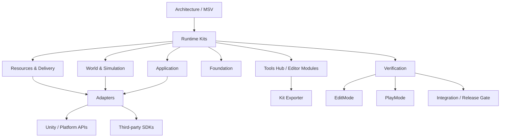

<div align="center">

# ✦ StellarFramework

### Modular · Exportable · Production-Oriented Unity Framework

A modular Unity framework designed around real project delivery.<br>
Select only the Kits you need, isolate external dependencies behind adapters, and keep tooling and verification as first-class parts of the workflow.


[Quick Start](#quick-start) · [Capabilities](#capabilities) · [Architecture](#architecture) · [Verification](#verification) · [Documentation](Assets/StellarFramework/FrameworkDoc/README.md) · [中文](README.md)

</div>

---

## Why StellarFramework

StellarFramework is not a bundle of unrelated managers. Its design is centered on **modularity, replaceability, and verifiability**.

| Area | Goal |
| --- | --- |
| **Modular Kits** | Keep Kits independently usable and exportable whenever practical |
| **Adapter Isolation** | Isolate Unity APIs, resource backends, third-party SDKs, storage, and platform integrations |
| **Export Profiles** | Resolve declared dependencies for atomic, complete, and extension profiles |
| **Editor Tooling** | Provide a unified Tools Hub for building, scanning, generating, diagnosing, and maintaining framework capabilities |
| **Verification Gates** | Separate Behavior, Performance, Policy, PlayMode, Integration, and Release validation |
| **MSV Architecture** | Model owns state, Service owns business rules, View owns presentation and forwards intent |

The goal is not to make every project install everything. The goal is to let each project take exactly the capabilities it needs.

## Capabilities

### Application

`UIKit` · `LocalizationKit` · `AudioKit` · `SaveKit` · `FlowKit` · `SettingsKit`

### Resources & Delivery

`ResKit` · `HybridCLRKit` · `Addressables Adapter` · `YooAsset Adapter`

### Foundation

`EventKit` · `ConfigKit` · `LogKit` · `PoolKit` · `SingletonKit` · `TimeKit` · `BindableKit` · `FSMKit` · `ActionKit` · `HttpKit`

### World & Simulation

`GridKit` · `SpatialKit` · `PathKit` · `SimulationKit` · `WorldKit` · `WorldGenKit` · `PlacementKit`

This includes grid and spatial primitives, generic pathfinding, scheduled simulation, world/chunk organization, deterministic world-generation pipelines, feature/resource generation, placement rules, and optional Unity presentation adapters.

For the complete Kit catalog and dependency rules, see [FrameworkDoc](Assets/StellarFramework/FrameworkDoc/README.md) and [Kit Architecture Guide](Assets/StellarFramework/FrameworkDoc/01-Architecture/KitArchitectureGuide.md).

## Quick Start

The primary development baseline is Unity `2022.3.62f3c1`, with compatibility targets for Unity `2022.3 LTS` and `6000.x`.

### Open the full framework project

1. Clone the repository and open it with a compatible Unity version.
2. Wait for UPM dependencies to resolve.
3. Open `StellarFramework -> Tools Hub`.
4. Go to `Start Here -> Quick Start`.

### Export only what you need

Open:

```text
StellarFramework -> Export
```

The exporter resolves profile dependency closure and produces dependency notes beside the exported package.

| Goal | Suggested profile |
| --- | --- |
| Architecture only | `Architecture.cs` / `Extensions.cs` |
| UI | `UIKit.Core` or `UIKit Complete` |
| Localization | `LocalizationKit.Core` or `Localization Complete` |
| Resources | `ResKit.Core`, a backend profile, or `ResKit Complete` |
| Code hot update | `HybridCLRKit` / `Hot Update Full` |
| Grid and pathfinding | `GridKit` / `PathKit` / optional adapters |
| World systems | World / WorldGen / Placement profiles |

See the [Quick Start guide](Assets/StellarFramework/FrameworkDoc/00-Overview/快速开始.md) for details.

## Architecture



Core boundaries:

- `Model` — state and data
- `Service` — business rules and state mutation
- `View` — presentation and input forwarding
- `Adapter` — Unity, SDK, networking, storage, and platform implementation boundaries
- `Editor Modules` — development and delivery tooling that stays outside Runtime Kits

## Tools Hub

`StellarFramework -> Tools Hub` is the common editor entry point for Quick Start, resource workflows, HybridCLR artifacts, diagnostics, scanners, generation tools, and Kit-specific maintenance utilities.

The repository currently does not contain polished screenshots suitable for the GitHub landing page, so this README intentionally avoids mockups or placeholders. Real screenshots of Tools Hub and the Export window should be added once they are captured from the current UI.

## Verification

Verification is treated as part of the framework rather than as an occasional release task.

```text
Kit Behavior
    ↓
Performance
    ↓
Framework Policy
    ↓
Integration / PlayMode
    ↓
Clean Consumer / Player / Release Gate
```

The validation surface includes:

- Kit Behavior tests
- Performance and scale tests
- Architecture / Catalog / Packaging policy checks
- PlayMode runtime tests
- Clean Consumer validation
- Player / Android release verification
- Addressables / YooAsset / HybridCLR delivery validation

Start here:

- [Validation architecture](Assets/StellarFrameworkVerification/ValidationArchitecture.md)
- [Maintainer verification area](Assets/StellarFrameworkVerification/README.md)
- [Current validation status](Assets/StellarFramework/FrameworkDoc/08-Validation/ValidationCurrentStatus.md)
- [Kit export validation matrix](Assets/StellarFramework/FrameworkDoc/08-Validation/KitExportValidationMatrix.md)

## Repository Boundaries

```text
Assets/
├─ StellarFramework/              Runtime, Editor Modules, Samples, Tests, Docs
├─ StellarFrameworkBootstrap/     full-package installation flow
├─ StellarFrameworkVerification/  Integration / Player / Release validation
└─ GameHotUpdate/                 Runtime Delivery Example / Verification Fixture
```

- `Samples` answer “how do I use this?”
- `Tests` cover Kit Behavior, Performance, and Framework Policy.
- `StellarFrameworkVerification` is maintainer infrastructure, not normal Kit distribution content.
- Third-party dependencies should remain behind Adapter / Integration boundaries whenever practical.

## Documentation

Recommended entry points:

- [FrameworkDoc overview](Assets/StellarFramework/FrameworkDoc/README.md)
- [Quick Start](Assets/StellarFramework/FrameworkDoc/00-Overview/快速开始.md)
- [Kit architecture and dependency rules](Assets/StellarFramework/FrameworkDoc/01-Architecture/KitArchitectureGuide.md)
- [Tools Hub](Assets/StellarFramework/FrameworkDoc/04-ToolsHub/StellarToolsHub-说明文档-Guide.md)
- [ResKit](Assets/StellarFramework/FrameworkDoc/02-Kits/Reskit/ResKit-统一资源-说明文档-Guide.md)
- [LocalizationKit](Assets/StellarFramework/FrameworkDoc/02-Kits/LocalizationKit/LocalizationKit-Guide.md)
- [FlowKit](Assets/StellarFramework/FrameworkDoc/02-Kits/FlowKit/FlowKit-工作流系统-说明文档-Guide.md)
- [Validation](Assets/StellarFramework/FrameworkDoc/08-Validation/Tests-说明文档-Guide.md)

## Project Fit

StellarFramework is most useful when you want to maintain shared Unity infrastructure across multiple projects without forcing every project to import the whole framework.

It is particularly suitable when modular delivery, dependency isolation, performance discipline, automated validation, and repeatable release workflows matter. For a very small one-off feature, a standalone Kit or Unity's built-in capability may be a better fit than adopting the entire framework.

---

<div align="center">

**StellarFramework — Build only what the project actually needs.**

[中文](README.md) · [English](README_EN.md)

</div>
